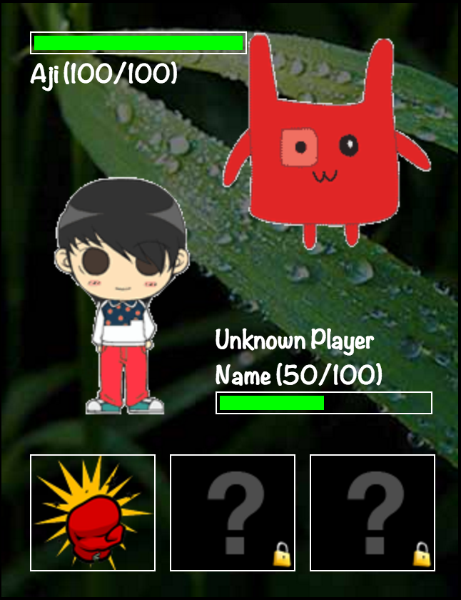

90s RPG Combat 
========

This is a HTML5 minigame originally designed to be played within the ARIS game, kkomamon

It mimics a classic 90s RPG combat, something like Ultima I or Final Fantasy I.

You can load it outside of ARIS, by downloading and launching the index.html file in a desktop browser.

To use this within ARIS, you will need to configure the first few lines of code to reflect the id numbers used in your game. 

